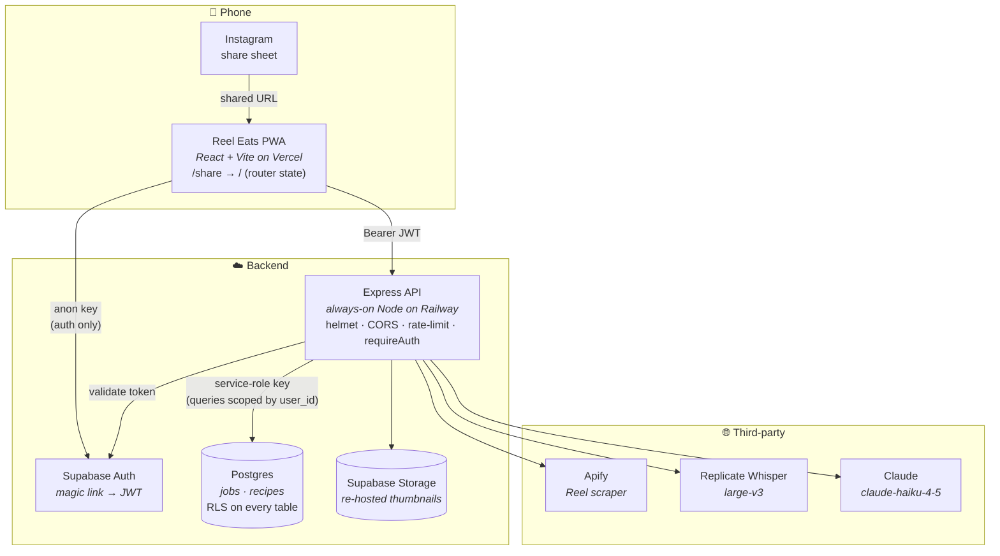
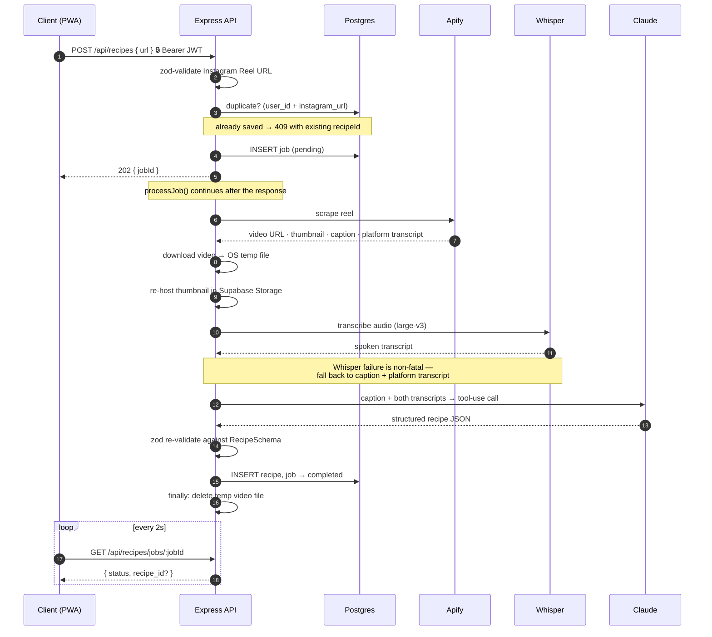
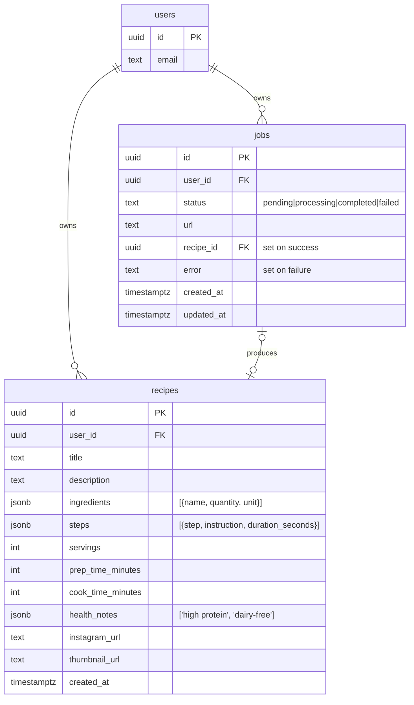

# 🍳 Reel Eats

**Turn any Instagram Reel into a structured, cookable recipe.**

Food Reels are great at inspiring you and terrible at feeding you — the quantities are
spoken, never written; the steps scroll past in 2 seconds; and the post you saved is
buried three weeks deep in your collection. Reel Eats fixes that: share a Reel to the
app and ~30 seconds later you have a real recipe — ingredients with amounts, numbered
steps, times, and health notes — saved to your account.

It's a PWA, so it installs to a phone home screen and registers as a **native share
target**: tap Share on a Reel in Instagram → tap Reel Eats → done. No copy-paste, no app store.


**At a glance** — solo full-stack build · TypeScript end to end · React PWA + Express API +
Postgres · three AI/scraping services orchestrated in one async pipeline · 48 tests ·
RLS, JWT auth, and rate limiting throughout.

---

## What it does

- **Save a Reel in one tap.** Share a Reel from Instagram and the app picks it up — or
  paste the link in yourself. No copy-paste dance either way.
- **Get a real recipe back in ~30 seconds.** Title, description, every ingredient with a
  quantity, numbered steps, prep and cook times, servings, and health notes like
  "high protein" or "dairy-free."
- **Fills in what the video leaves out.** Creators say "a splash of this" and never write
  amounts down. The app estimates sensible quantities instead of leaving blanks, because
  a recipe with a missing amount is useless once you're actually cooking.
- **Keeps a personal cookbook.** Browse saved recipes as cards with thumbnails, search by
  title, open a full step-by-step cooking view, delete what you don't want.
- **Won't save the same Reel twice.** Re-sharing something you already saved opens the
  existing recipe instead of burning 30 seconds and an API call.
- **Installs like an app.** Add to home screen on iOS or Android — no app store, no
  download.

Sign-in is a passwordless email link, and every recipe is private to the account that
saved it.

*Everything below is how it's built.*

## How it works

The app ships as three pieces: a static React PWA on a CDN, an always-on Node API, and
Supabase for auth, Postgres, and file storage. The browser talks to Supabase **only** to
sign in — every read and write of recipe data goes through the API behind a validated
JWT, so the database is never exposed directly to the client.



## The extraction pipeline

The pipeline takes ~30 seconds — far too long to hold an HTTP request open on a phone
that may background the tab. So `POST /api/recipes` **persists a job, kicks off the work
fire-and-forget, and returns `202` with a job ID immediately**. The client polls; from
the share sheet it doesn't even do that — it confirms "queued" and lets the user leave.



**Why three text sources?** Reels are noisy in different ways. Captions have hashtags
and vibes but skip amounts. Platform auto-captions are lossy. Whisper hears what the
creator actually said ("about a tablespoon of miso") but not what's on screen. Claude
reconciles all three, with Whisper weighted highest, and is explicitly instructed to
make a reasonable culinary estimate rather than emit a null — a recipe with a blank
quantity is useless in a kitchen.

## Engineering decisions worth calling out

| Decision | Why | Trade-off accepted |
|---|---|---|
| **Async job + polling**, not a blocking request | ~30s pipeline; HTTP timeouts and mobile backgrounding make a synchronous request unreliable | Client polls; job state must be persisted |
| **Always-on Node (Railway)**, not serverless | `processJob()` keeps running *after* the response is sent — serverless would freeze or kill the container mid-flight | Pay for idle; no free horizontal scale |
| **Fire-and-forget in-process**, no queue | Removes an entire piece of infrastructure at current volume | In-flight jobs are lost on restart/deploy |
| **Claude tool-use**, not free-text JSON | The tool `input_schema` constrains the shape *at generation time*; zod re-validates after, so malformed AI output never reaches Postgres | Schema is defined twice (tool schema + zod) |
| **One `shared/` zod package** | A single `RecipeSchema` validates the AI output, the DB read, *and* the API contract — the three places shapes usually drift | Both apps must resolve the workspace package |
| **Thumbnails re-hosted in Supabase Storage** | Instagram CDN URLs are signed and expire, silently breaking saved recipes days later | Storage cost and one extra hop per job |
| **Whisper is best-effort** | A transcription failure shouldn't lose a recipe — the pipeline degrades to caption + platform transcript | Lower fidelity on those recipes |
| **PWA-first**, not React Native | Ships without an app-store release cycle, and the Web Share Target API delivers the one-tap capture that is the whole product | No true native integrations |

## Tech stack

| Layer | Choice |
|---|---|
| Frontend | React 18 + Vite + TypeScript, React Router, hand-rolled CSS, service worker + Web App Manifest (share target) |
| Backend | Node 22 + Express + TypeScript, helmet, CORS, `express-rate-limit`, pino structured logging |
| Data | Supabase — Postgres with RLS on every table, Auth (magic link), Storage |
| AI | Anthropic `claude-haiku-4-5` (tool-use extraction), Replicate Whisper `large-v3` |
| Scraping | Apify Instagram Scraper actor |
| Validation | zod schemas in `/shared`, shared by client and server |
| Tests | Vitest + supertest — 48 tests |
| Infra | Vercel (client), Railway (Docker, healthchecked), npm workspaces, `just` task runner |

## Data model



Ingredients and steps live in `jsonb` rather than child tables: they're always read and
written as a whole recipe, never queried across, so normalizing would buy joins nobody
performs. Row Level Security is on for both tables with per-user policies.

## API surface

Every route requires a `Bearer` JWT. **User identity always comes from the validated
token — never from the request body.**

| Method | Route | Purpose |
|---|---|---|
| `POST` | `/api/recipes` | Validate URL, create job, start pipeline → `202 { jobId }` (or `409` with the existing recipe) |
| `GET` | `/api/recipes/jobs/:jobId` | Poll job status |
| `GET` | `/api/recipes` | List the user's recipes |
| `GET` | `/api/recipes/:id` | Fetch one recipe |
| `DELETE` | `/api/recipes/:id` | Delete a recipe |
| `GET` | `/health` | Unauthenticated healthcheck (Railway) |

Responses are uniformly `{ data }` or `{ error: { code, message } }`.

## Security

Security rules are treated as invariants, not aspirations:

- **Secrets never reach the browser.** Service-role, Anthropic, Apify, and Replicate keys
  are server-only; `supabaseAdmin.ts` is barred from leaving `/server`. Vite exposes only
  `VITE_`-prefixed vars by construction.
- **RLS on every table**, plus manual `user_id` scoping on every server query — the
  server holds the service-role key, so RLS is defense-in-depth behind explicit filters.
- **Input validation at the boundary.** Reel URLs are regex-validated by zod before ever
  reaching Apify; no user input is concatenated into SQL (Supabase query builder only).
- **Rate limits** — 10 recipes/user/hour, 5 auth attempts/IP/15min, 100 req/IP/15min.
- **helmet on every response**, CORS locked to one exact origin, no wildcard.
- **No stack traces to clients.** A global error handler returns an opaque
  `INTERNAL_ERROR`; details go to pino logs, with `authorization` headers redacted.
- **No `select('*')`** in production paths — explicit column lists only.
- Temp video files are written to the OS temp dir and deleted in a `finally` block.

## Testing

```bash
just test          # server suite (Vitest + supertest)
just check         # lint + typecheck, both packages
```

48 tests across the pipeline: route contracts (auth, validation, duplicate detection,
rate limiting), the `processJob` orchestration including its failure and cleanup paths,
Claude extraction with a mocked SDK, Whisper, the Apify scraper, and the DB layer.
External services are mocked at the module boundary, so the suite runs offline in
under a second.

## Running it locally

**Prerequisites:** Node 22+, npm, [`just`](https://github.com/casey/just), and a Supabase
project (or the Supabase CLI for a local stack). API keys for Anthropic, Apify, and
Replicate are needed for the full pipeline.

```bash
git clone https://github.com/kelly8hu/reel-eats.git
cd reel-eats
npm install

cp .env.example .env          # fill in the values below
cp .env.example client/.env.local

supabase db push              # apply migrations (or: supabase start && supabase db reset)

just dev                      # client on :5173, server on :3000
```

| Variable | Where | Notes |
|---|---|---|
| `SUPABASE_URL`, `SUPABASE_SERVICE_KEY` | server | service key is **server-only** |
| `ANTHROPIC_API_KEY` | server | recipe extraction |
| `APIFY_API_TOKEN` | server | Reel scraping |
| `REPLICATE_API_TOKEN` | server | Whisper transcription |
| `CORS_ORIGIN` | server | exact frontend origin, no trailing slash |
| `VITE_SUPABASE_URL`, `VITE_SUPABASE_ANON_KEY` | client | anon key only |
| `VITE_API_URL` | client | API origin |

Other useful commands: `just build`, `just lint`, `just typecheck`, `just audit`,
`just test-file server/services/ai.test.ts`.

## Deployment

**Client → Vercel.** Root directory `client`, build `npm run build`, output `dist`.
SPA rewrites via `client/vercel.json` so `/share` resolves. Env: the two `VITE_` vars.

**Server → Railway.** Docker build per `railway.toml`, healthcheck on `/health`,
restart-on-failure. Env: all server-side vars, with `CORS_ORIGIN` set to the Vercel
production URL.

**Database → Supabase.** Migrations in `supabase/migrations/`, applied with
`supabase db push`.

## Project structure

```
.
├── client/              # React + Vite PWA
│   ├── public/          # manifest.json (share_target), service worker, icons
│   └── src/
│       ├── pages/       # Home · Recipes · RecipeDetail · Profile · ShareTarget
│       ├── hooks/       # useAuth
│       └── lib/         # api client, supabase browser client
├── server/              # Express API
│   └── src/
│       ├── routes/      # thin HTTP handlers + processJob orchestration
│       ├── services/    # scraper · whisper · ai · db · storage  ← all business logic
│       ├── middleware/  # requireAuth (JWT → req.user)
│       └── lib/         # supabaseAdmin (service role), pino logger
├── shared/              # zod schemas + inferred types, imported by both sides
└── supabase/migrations/ # SQL migrations, RLS policies
```

Dependency direction is enforced by convention and reviewed on every change:
`shared → server services → server routes → client lib → client hooks → client pages`.
No business logic lives in route handlers or components.

## Roadmap and known limitations

- **Mood-based recommendations** and **pantry filtering** are scaffolded in the UI but
  not yet wired to the backend — the ingredient data model is in place for both.
- **In-flight jobs are lost on deploy.** The honest fix is a durable queue with retries;
  at current volume the added infrastructure isn't worth it yet.
- **Instagram only.** TikTok and YouTube Shorts would slot in behind the same
  `scrapeReel` interface.
- **No offline recipe access** — the service worker caches static assets only.
- A dev-only unauthenticated test route exists in `server/src/routes/index.ts` and is
  flagged for removal before public launch.
